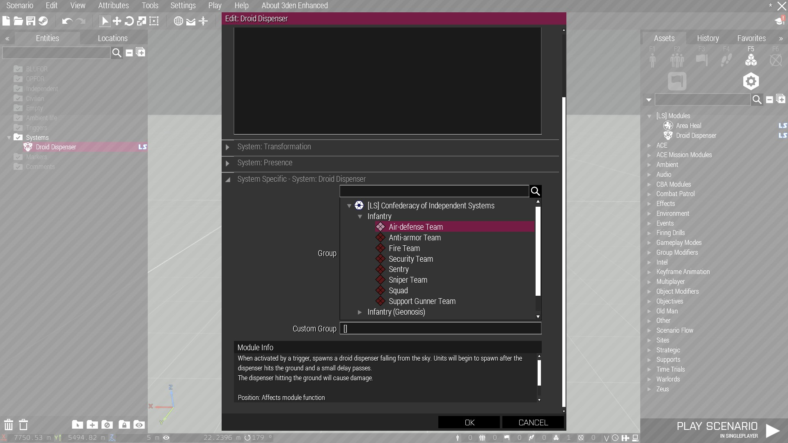
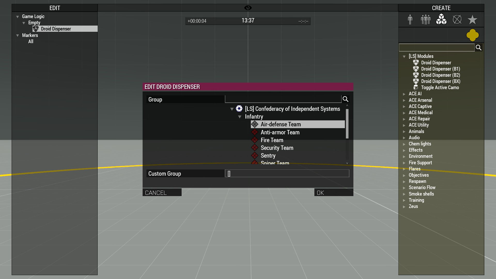

# Droid Dispensers

## 1. Usage
The easiest and most common way to use the Droid Dispensers is via the Eden and Zeus modules for it.

Both modules have the same options available, the "Group" field allows you to select a group defined in `CfgGroups` that have been configured to be available to Droid Dispensers. Simply click on the option and pressing OK will select it.

You can use the search bar to search for a specific faction, category, or group name.

If you'd like more customization, you can also provide a list of unit class names in the "Custom Group" field. It should be formatted as `['unitClass1','unitClass2']`. Unit classes that aren't defined will be filtered out.

### Eden
To use the Eden module, simply place it from the `[LS] Modules` category. Double click on it and scroll down to the module settings.

The eden module is activated via trigger, meaning you can have it activate from a radio signal; from players entering an area; having BLUFOR being detected by OPFOR; etc.

<figure>
    
    <figcaption></figcaption>
</figure>

### Zeus
To use the Zeus module, simply place it from the `[LS] Modules` category. After selecting a group, press OK and the droid dispenser will begin to fall. Your last selected options will also be saved for the mission, and the next module you place will have the same settings as the last one you used.

A yellow circle around the module will be shown similar to the vanilla ordinance modules. Other Zeuses will be able to see this circle as well.

<figure>
    
    <figcaption></figcaption>
</figure>
