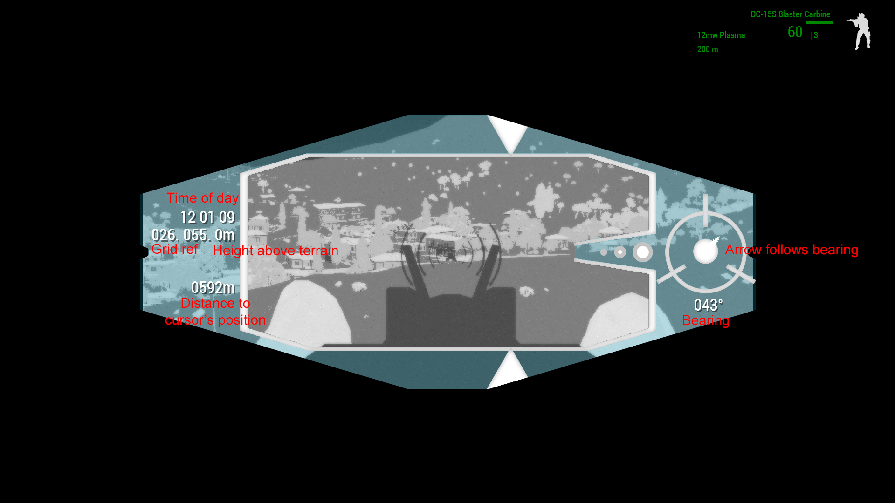

# Rangefinders

NVGs can be configured to display extra information by using custom HUD elements. These HUD elements will automatically be displayed when enabling night / thermal vision, and then hidden when switching back to normal vision.

Here's an example of the Phase 1 and Phase 2 rangefinder NVGs' HUD.

<figure><figcaption></figcaption></figure>
