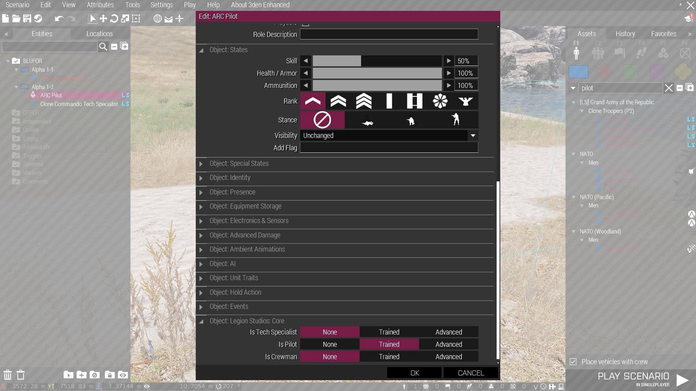

# Skills

The skills framework aims to make it easier on mission / mod makers to check for things like if a unit is a pilot, tank driver, etc.

Skills like medic, engineer, and EOD are compatible with vanilla and ACE.

## 1. Usage

### 1.1 Object properties

Double clicking a unit and scrolling down to `Object: Legion Studios: Core` will show a section where mission makers can set the skill levels of additional skills that aren't already handled by vanilla Arma or ACE. These cover things like piloting, driving, and slicing / hacking.

These values will be whatever skill levels the unit has by default, but can be easily overwritten by setting the values to whatever you like.

## 2. Examples
### 2.1 Reinsert Terminal
The Reinsert Terminal (Objects > [LS] Static Objects > Electronics) has a user (scroll wheel) action that will send a message to all players with the Pilot skill on the same side of the person who used the action.

This is one example of how these skills can be used.
