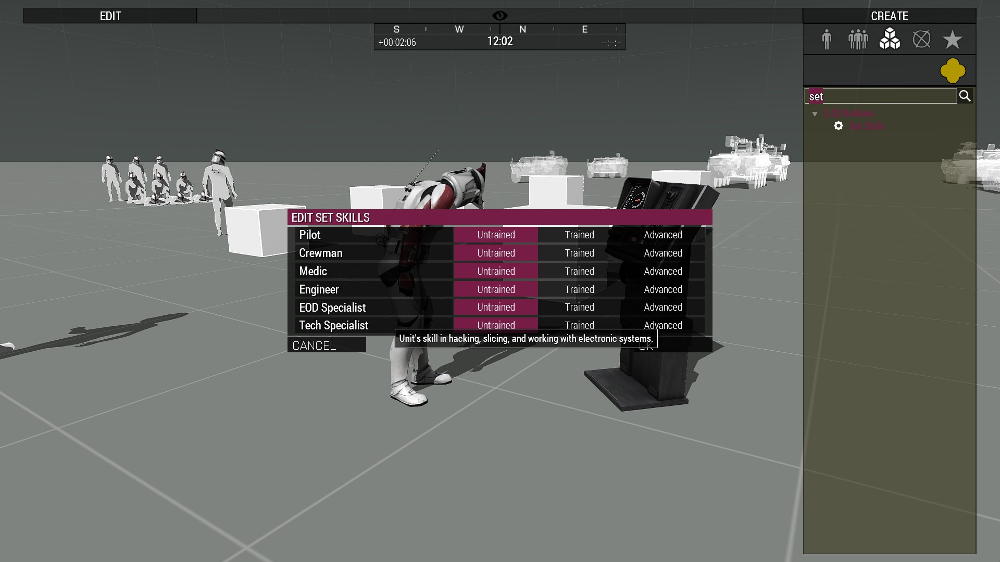

# Skills

The skills framework aims to make it easier on mission / mod makers to check for things like if a unit is a medic, pilot, tank driver, etc.

Skills like medic, engineer, and EOD are compatible with vanilla and ACE.

## 1. Usage

### 1.1 Eden Attributes

Double clicking a unit and scrolling down to `Object: Legion Studios: Core` will show a section where mission makers can set the skill levels of additional skills that aren't already handled by vanilla Arma or ACE. These cover things like piloting, driving, and slicing / hacking.

These values will be default to the skills that the unit has based on its config, as opposed to a separate "Default" option like how ACE implements theirs.

#### 1.2 Zeus Module

A zeus module is available and will populate will all configured skills, like the Eden attributes the values will default to the unit's current skill levels.

## 2. Examples
### 2.1 Reinsert Terminal
The Reinsert Terminal (Objects > [LS] Static Objects > Electronics) has a user action (scroll wheel) that will send a message to all players with the Pilot skill on the same side of the person who used the action.
