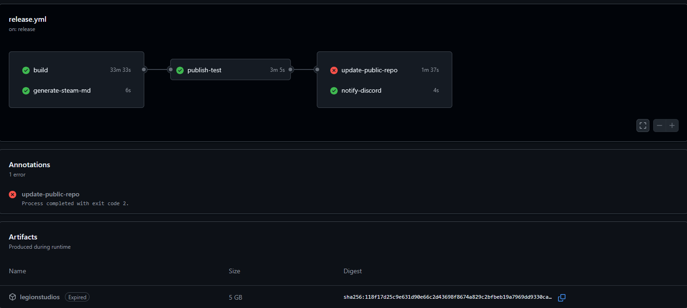

# Action file

Legion Studios uses GitHub Actions to automate our release pipeline. This allows us to publish releases in Github and go hands off for the rest of the process. The action is triggered by publishing a release. It will automatically build the mod and upload it to the Steam Workshop.

## Workflow File

```yaml
name: Release

on:
  release:
    types: [published]
  workflow_dispatch:

jobs:
  build:
    runs-on: windows-latest
    steps:
    # THIS IS JUST HOW WE DOWNLOAD BINARIZE. YOU CAN HOST IT ANYWHERE AND DOWNLOAD IT HOWEVER YOU WANT, AS LONG AS IT'S AVAILABLE DURING THE WORKFLOW.
    - name: Configure AWS credentials
      uses: aws-actions/configure-aws-credentials@v5
      with:
        aws-access-key-id: ${{ secrets.AWS_ACCESS_KEY_ID }}
        aws-secret-access-key: ${{ secrets.AWS_SECRET_ACCESS_KEY }}
        aws-region: us-east-2
    - name: Checkout the source code
      uses: actions/checkout@v4
      with:
        submodules: true
    - name: Setup HEMTT
      uses: arma-actions/hemtt@v1
    - name: Setup Binarize
      run: |
        $presignedUrl = aws s3 presign {redacted for privacy} --expires-in 3600
        curl -L -o legionstudios-tools.zip "$presignedUrl"
        Expand-Archive legionstudios-tools.zip -DestinationPath ci
        echo "Check Binarize: $(Test-Path .\\ci\\binarize\\binarize_x64.exe)"
        echo "Install Binarize dependencies"
        cp .\ci\binarize\X3DAudio1_7.dll,.\ci\binarize\XAPOFX1_5.dll C:\Windows\System32\
        echo "::group::Verify Binarize dependencies installed"
        Get-ChildItem C:\Windows\System32\X3DAudio1_7.dll, C:\Windows\System32\XAPOFX1_5.dll
        echo "::endgroup::"
        echo "Dependencies installed"
        New-Item "HKCU:\\Software\\Bohemia Interactive\\binarize" -Force | New-ItemProperty -Name path -Value "${{ github.workspace }}\ci\binarize"
        echo "Binarize configured"
    - name: Test Binarize
      run: |
        echo "::group::Run Binarize without arguments (look for missing DLLs)"
        ./ci/binarize/binarize_x64.exe || true  # binarize exits with 1 if no file given
        echo "::endgroup::"
      shell: bash  # outputs missing dll information
    - name: Build (HEMTT)
      run: |
        hemtt release --no-archive
    - name: Rename build folder
      run: mv .hemttout/release .hemttout/@Legion-Core
    - name: Upload Artifacts
      uses: actions/upload-artifact@v4
      with:
        name: legionstudios
        path: .hemttout/@*
        retention-days: 1
        include-hidden-files: true

  generate-steam-md:
    runs-on: ubuntu-latest
    steps:
      - name: Convert Release to Steam
        uses: legion-studios/markdown-to-steam@v1
        id: generate-steam-md
        with:
          markdown: ${{ github.event.release.body }}
    outputs:
      steammd: ${{ steps.generate-steam-md.outputs.steammd }}

  publish:
    needs: [build, generate-steam-md]
    runs-on: ubuntu-latest
    steps:
      - name: Download Artifacts
        uses: actions/download-artifact@v4
        with:
          name: legionstudios
      - name: Upload to Steam (Legion Studios Dev Builds)
        uses: arma-actions/workshop-upload@v1
        with:
          appId: '107410' # Arma 3 App ID
          itemId: 'your steam workshop item id here'
          contentPath: '@Legion-Core'
          changelog: ${{ needs.generate-steam-md.outputs.steammd }}
        env:
          STEAM_USERNAME: ${{ secrets.STEAM_USERNAME }}
          STEAM_PASSWORD: ${{ secrets.STEAM_PASSWORD }}

  notify-discord:
    needs: [publish]
    runs-on: ubuntu-latest
    steps:
      - name: Send Discord Notification
        uses: tsickert/discord-webhook@v7.0.0
        with:
          webhook-url: ${{ secrets.DISCORD_WEBHOOK_URL }}
          content: ${{ github.event.release.body }} # this will be the formatted markdown
```

## Explanation

The workflow consists of three jobs: `build`, `publish`, and `notify-discord`.
- The `build` job runs on a Windows runner and performs the following steps:
  - Configures AWS credentials to download Binarize from a private S3 bucket.
    - You do not need to use an S3 bucket for Binarize. You can host it wherever you want, as long as the action can download it during the workflow.
  - Checks out the source code, including submodules.
    - We have a translations submodule, which is why we need to include submodules in the checkout step. If you don't have any submodules, you can delete
    ```
    with:
        submodules: true
    ```
  - Sets up HEMTT and Binarize.
  - Builds the mod using HEMTT.
  - Renames the build folder to `@Legion-Core` for Steam compatibility.
  - Uploads the built mod as an artifact for use in later jobs.
   - Our artifacts are ungodly large because we have a lot of p3d's, audio files, and other assets that are needed for the mod to function. If your mod is smaller, you will not experience as long of release times as we do.

   We have to use a Windows runner for the build job because Binarize is a Windows executable and HEMTT relies on it for packing the pbo files.

- The `generate-steam-md` job runs on an Ubuntu runner and converts the release body markdown into a format suitable for Steam using a custom action.
- The `publish` job depends on both the `build` and `generate-steam-md` jobs. It downloads the built mod artifact and uploads it to the Steam Workshop using another custom action `arma-actions/workshop-upload`. The changelog for the Steam upload is set to the formatted markdown from the previous job.

    There you have to disable Steam Guard for the account you are using to upload to the Workshop. This is problematic because recent Steam Changes force workshop uploads to be friends-only if Steam Guard is disabled. We're currently working on a solution to this.

- The `notify-discord` job depends on the `publish` job and sends a notification to a Discord channel using a webhook, with the content set to the release body markdown.



## Secrets
The workflow uses the following secrets, which need to be configured in the GitHub repository settings:
- `AWS_ACCESS_KEY_ID`: AWS access key ID for downloading Binarize from the S3 bucket.
    - Optional depending on how you choose to host the zip file.
- `AWS_SECRET_ACCESS_KEY`: AWS secret access key for downloading Binarize from the S3 bucket.
    - Optional depending on how you choose to host the zip file.
- `STEAM_USERNAME`: Steam username for uploading to the Steam Workshop.
- `STEAM_PASSWORD`: Steam password for uploading to the Steam Workshop.
- `DISCORD_WEBHOOK_URL`: Webhook URL for sending notifications to Discord.
